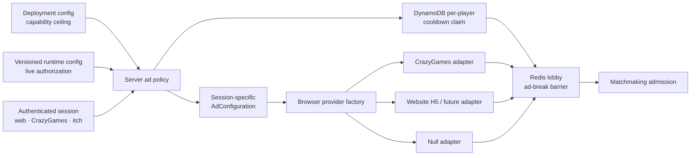
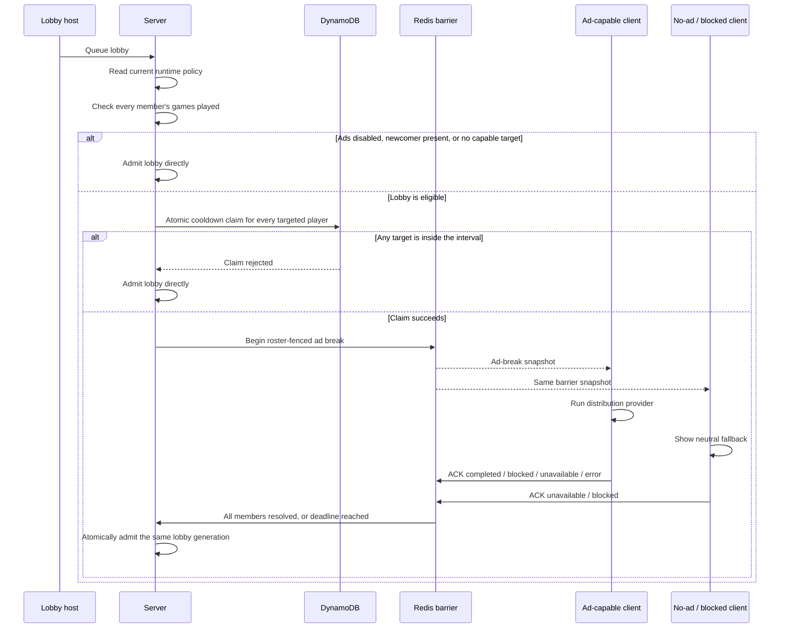
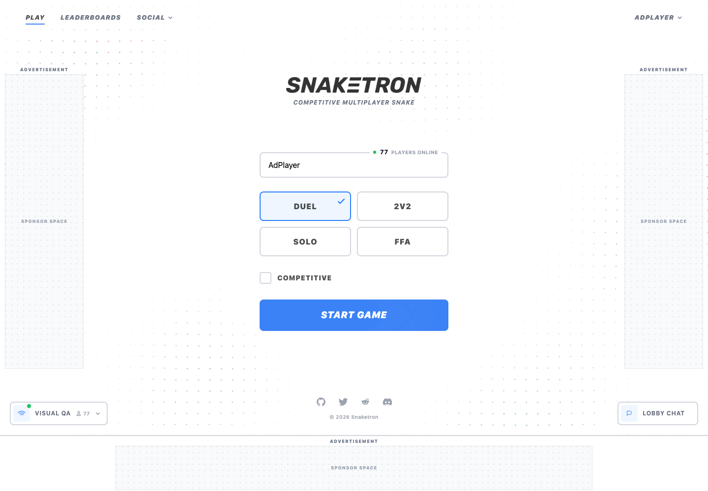
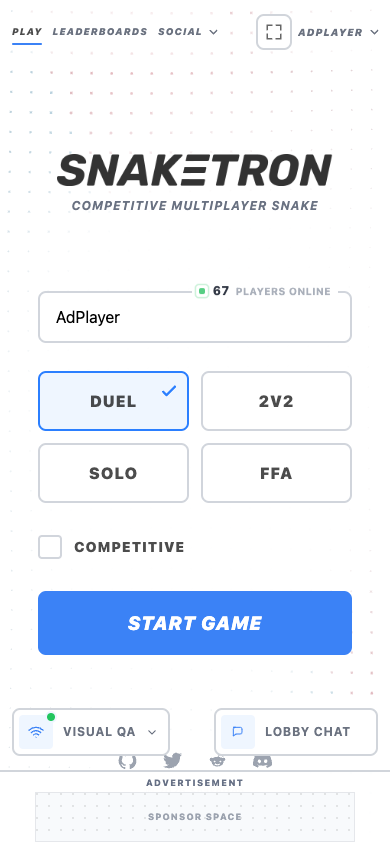
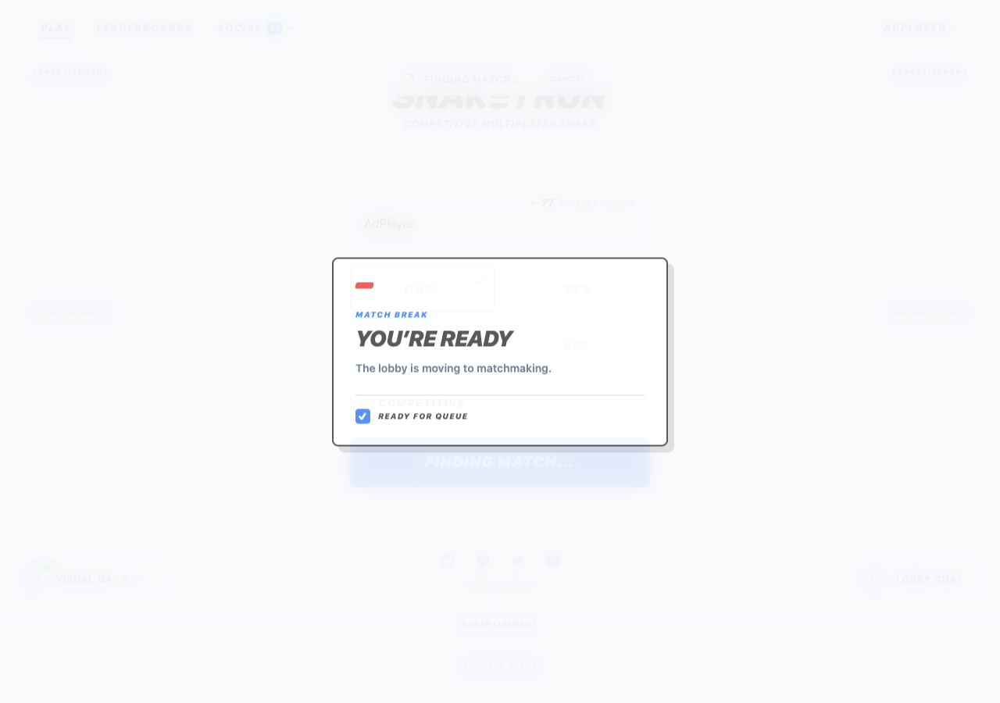
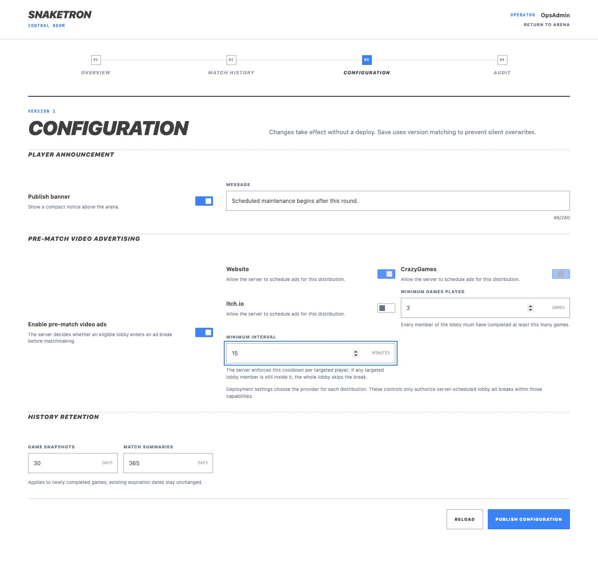

# Advertising design

Snaketron treats advertising as a server-owned lobby policy with a replaceable
browser SDK boundary. A deployment declares which providers and placements are
available for each distribution; the live runtime record decides whether an
eligible lobby may enter a pre-match break. Browser code never independently
decides that an ad should run.

## Authority and provider routing

The deployment and runtime layers are both fail-closed. Runtime controls cannot
enable a provider or placement that the deployment did not make available, and
an unknown/missing SDK resolves through the null adapter without delaying the
lobby indefinitely.

## Lobby state and acknowledgement flow

Every terminal provider result counts as resolved. Ad blocking is honored as a
normal result; the UI never asks a player to disable or uninstall anything.
Reconnects replay the authoritative barrier snapshot and an identity-bound
outbox resends the same acknowledgement until the server confirms it.

## Banner layouts

The generic layout supports one bottom placement on mobile and desktop plus two
desktop rails when the provider permits three concurrent banners. Provider
capabilities may reduce the selected set; for example, the CrazyGames adapter
caps itself at two concurrent banners. These captures use neutral sponsor-space
placeholders rather than simulated ad creative. The desktop rails are fixed
viewport overlays: they never create columns, narrow the app, or move its
controls. Only the bottom placement reserves layout space.

### Desktop: reserved bottom bar and floating rails

### Mobile: bottom bar only

## Pre-match fallback

Blocked, unavailable, no-fill, and integration-error outcomes use the same
neutral waiting surface. Matchmaking proceeds when every member has resolved or
the server deadline closes the barrier.

## Runtime administration

The controls from PR #66 are intentionally modeled as pre-match policy. The
minimum interval is enforced durably per targeted player, and every member of
the lobby must meet the minimum-games threshold.

